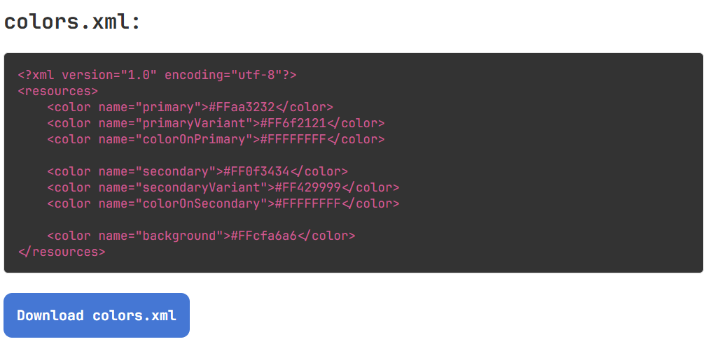

# xml-android-theme-generator
Simple tool for creating XML-based themes for Android apps.

You can also use it through GitHub pages: [https://imflawlezz.github.io/xml-android-theme-generator/]

# Usage:
1. Enter the application name:


It is needed to generate the application theme name:

```xml
<?xml version="1.0" encoding="utf-8"?>
<resources xmlns:tools="http://schemas.android.com/tools">
    <style name="Theme.MyAndroidApp" parent="Theme.MaterialComponents.DayNight.DarkActionBar">
        <!-- Application theme properties -->
    </style>
</resources>
```

2. Next, choose the primary color for your theme:


You can also set color in HSL as well as in HEX:


As well as a method for generating the secondary color:


The complementary method is recommended to use, but You also have an option to choose the "similar" method.

The difference is shown below:

Similar to Primary method:


Complementary method:


3. Additionally, you can enter the base font size and font family for the whole application. This feature is still in development and may not work as intended. You can leave the fields empty, but later you will need to erase them manually from `themes.xml` file.


```xml
<?xml version="1.0" encoding="utf-8"?>
<resources xmlns:tools="http://schemas.android.com/tools">
    <style name="Theme.MyAndroidApp" parent="Theme.MaterialComponents.DayNight.DarkActionBar">
        <item name="colorPrimary">@color/primary</item>
        <item name="colorPrimaryVariant">@color/primaryVariant</item>
        <item name="colorOnPrimary">@color/colorOnPrimary</item>

        <item name="colorSecondary">@color/secondary</item>
        <item name="colorSecondaryVariant">@color/secondaryVariant</item>
        <item name="colorOnSecondary">@color/colorOnSecondary</item>
        
        <!-- Empty tags must be removed -->
        <item name="android:fontFamily"></item>
        <item name="android:textSize">sp</item>
    </style>
</resources>
```

**Note:** When entering the font family, make sure you have all the necessary fonts installed and/or imported.

4. The night theme flag determines whether the `colors_night.xml` file will be generated. The color preview for the night theme itself will be generated regardless of the flag.

And there you have it! You can preview the output files and copy their contents or directly download them:



**! IMPORTANT NOTE !**

After getting the `colors_night.xml` file make sure to rename it into `colors.xml` and move it to `values-night` directory of your project.

---

Keep in mind the fact that this project is implemented using simple color generation algorithms (lightening, darkening and desaturation), pure JavaScript with the [TinyColor.js](https://github.com/bgrins/TinyColor) library and is still in the development stage.